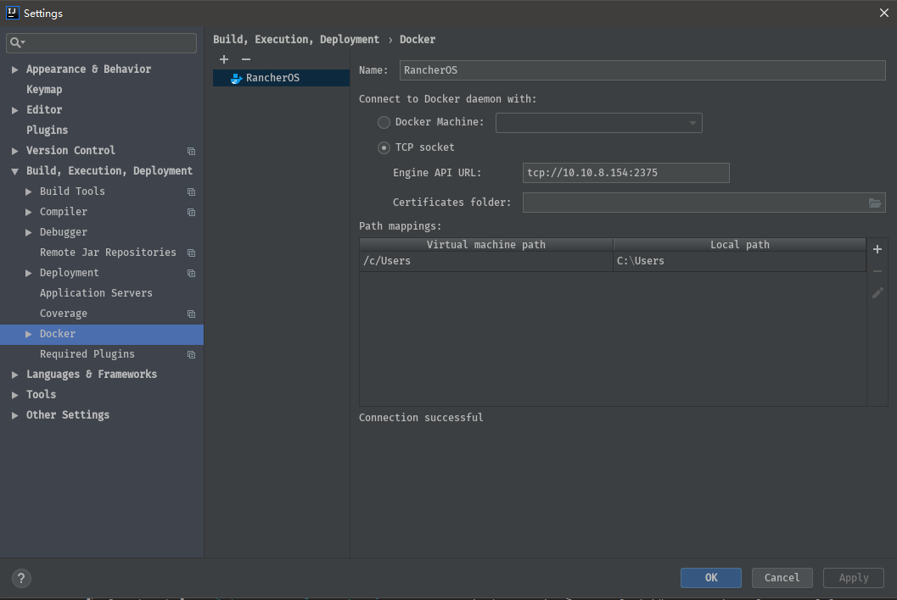
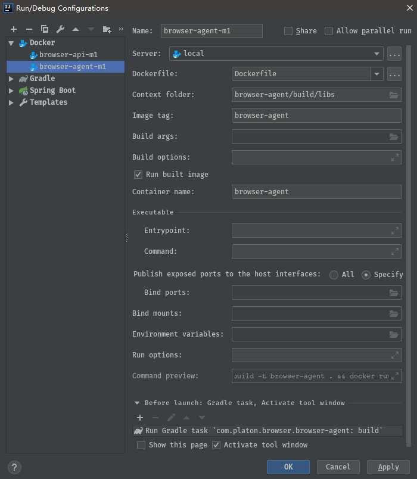
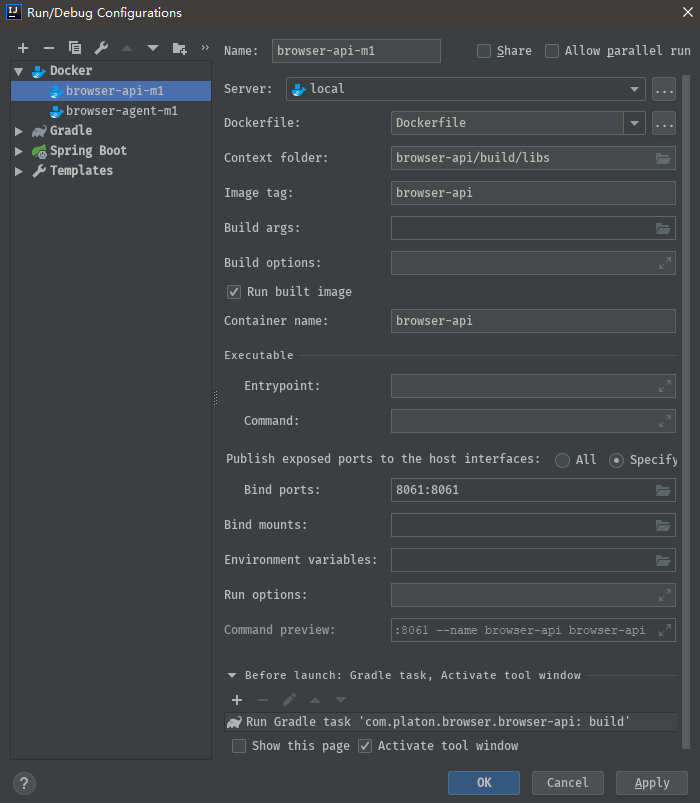

# 项目变更说明

### 一、springboot升级到2.1.3，原因：
##### 1、springboot1.5使用的jedis客户端不支持redis集群的pipeline批量查询键值操作（此为改进程序性能所需要的特性）；
##### 2、简化mybatis、generator配置；
### 二、合并模块并统一名称
##### 1、manager更名为browser-service,主要提供业务层逻辑和一些实用工具；
##### 2、dao、pojo、common合并到browser-common，主要提供dao操作类和dto类；
##### 3、agent更名为browser-agent，主要负责采集链上数据入库；
##### 4、server更名为browser-api，主要负责为前端提供访问api接口；
### 三、把项目构建工具更换为Gradle，简化依赖引入配置
### 四、各模块间依赖关系：
```
     _____________    ___________
    |browser-agent|  |browser-api|
     -------------    -----------
                 \    /
              _______________
             |browser-service|
              ---------------
                    |
              ______________
             |browser-common|
              --------------
```

### 五、接口文档生成说明
###### 1、安装NodeJs
```
https://nodejs.org/dist/v10.15.3/node-v10.15.3-x64.msi
```
###### 2、安装apidoc
```
npm install apidoc -g
```
###### 3、生成文档
```
apidoc -i browser-api/ -o apidoc/
```

### 六、IDEA Docker开发环境设置
###### 0、docker-machine安装
```
http://192.168.9.85:10080/tools/docker-machine.exe
安装容器操作系统，rancheros和boot2docker任选一个即可
# 创建虚拟机并安装rancheros容器操作系统
docker-machine create -d virtualbox --virtualbox-boot2docker-url http://192.168.9.85:10080/tools/rancheros.iso --virtualbox-memory 1024 mc01
# 创建虚拟机并安装boot2docker容器操作系统
docker-machine create -d virtualbox --virtualbox-boot2docker-url http://192.168.9.85:10080/tools/boot2docker.iso --virtualbox-memory 1024 mc01
```
###### 1、Docker服务端配置


###### 2、browser-agent部署配置

###### 3、browser-api部署配置


### 七、节点地理位置偏移设置，解决同一Linux操作系统部署多个Platon节点导致浏览器地图显示节点数缺失的问题
###### 1、进入浏览器部署目录，本说明以/opt/console_0.6.0/server/为例，查看内容：
```
[juzhen@Platon-Resource ~]$ cd /opt/console_0.6.0/server
[juzhen@Platon-Resource /opt/console_0.6.0/server]$ ls -la
total 45516
drwxrwxr-x. 2 juzhen juzhen      107 Apr 24 15:54 .
drwxrwxr-x. 6 juzhen juzhen       65 Apr 25 07:01 ..
-rwxrwxrwx. 1 juzhen juzhen      952 Apr 24 15:54 application-amigoApi.yml
-rw-r--r--. 1 juzhen juzhen 46595416 Apr 24 14:05 browser-api-0.6.0-SNAPSHOT.jar
-rwxrwxr-x. 1 juzhen juzhen      110 Apr 24 15:25 start.sh
-rwxrwxr-x. 1 juzhen juzhen       98 Apr 12 10:08 stop.sh
```
###### 2、查看启动配置文件内容：
```
[juzhen@Platon-Resource /opt/console_0.6.0/server]$ cat application-amigoApi.yml
# ***************************生产配置**************************** #
# 应用版本
version: 0.6.0
# 当前激活的配置名称
profile: amigo
# 服务器端口号
port: 28060
# MySQL数据库连接地址
dburl: jdbc:mysql://127.0.0.1:3306/platon_browser_${version}_${profile}?useUnicode=true&characterEncoding=utf-8&useSSL=false
dbuser: juzix
dbpass: Juzhen123!
# Platon链配置,格式【{chainName1}-{chainId1}-{http://nodeIP1:port1}[,{chainName2}-{chainId2}-{http://nodeIP2:port2}]】，多个链配置使用逗号分隔
chain.config: MAIN_NET-103-["http://10.0.0.5:6791","http://13.67.44.50:6791","http://13.67.44.50:6792"]
# Redis集群节点
redis: 10.0.0.8:21006,10.0.0.8:21007,10.0.0.8:21008,10.0.0.8:21009,10.0.0.8:21010,10.0.0.8:21011
# 日志文件存储文件
logpath: /opt/console/logs/${spring.application.name}-${version}-${profile}.log
# 日志级别
loglevel:
  spring: error
  platon: error
```
###### 3、从第2步中获取“应用版本”和“当前激活的配置名称”两个参数，本说明例子中的值分别为：0.6.0和amigo
###### 4、然后在当前启动浏览器进程的用户的home目录下建一个文件，文件名格式：fakelocation-<应用版本>-<当前激活的配置名称>.json，例如上面例子的文件名就是：
```
[juzhen@Platon-Resource /opt/console_0.6.0/server]$ touch ~/fakelocation-0.6.0-amigo.json
```
###### 5、编辑第4步创建的文件，文件的内容是一个json对象数组，格式及json对象的属性说明如下:
```
[juzhen@Platon-Resource /opt/console_0.6.0/server]$ vi ~/fakelocation-0.6.0-amigo.json
[
    {
        // 节点ID
        "nodeId":"0xa6ef31a2006f55f5039e23ccccef343e735d56699bde947cfe253d441f5f291561640a8e2bbaf8a85a8a367b939efcef6f80ae28d2bd3d0b21bdac01c3aa6f2f",
        "longitude":101.5304, // 要强制指定的经度
        "latitude":3.0538, // 要强制指定的纬度
        "name":"TEST-SEA" // 节点名称
    },
    {
        "nodeId":"0xc7fc34d6d8b3d894a35895aaf2f788ed445e03b7673f7ce820aa6fdc02908eeab6982b7eb97e983cc708bcec093b3bc512b0b1fbf668e6ab94cd91f2d642e591",
        "longitude":-73.7562,
        "latitude":42.6526,
        "name":"TEST-US"
    }
]

请按照实际需求，把需要强制设置地理位置的节点相关属性按上述格式配置。
关于经纬度的确定：可以根据原节点真实经纬度位置，按照实际需求对其进行偏移
根据IP查询经纬度的实用工具：https://iplocation.com/
```
###### 6、编辑完成后，访问刷新接口：
```
假设现在浏览器后端和nginx在同一台机器上，外网访问浏览器后端是通过nginx转发实现的，nginx所在机器外网ip为[192.168.1.100]，nginx的转发配置如下：
location /api-103{
     ...
     proxy_pass localhost:28060/browser-server
}
    
现在我们就可以通过如下命令访问刷新接口了：
curl http://192.168.1.100/api-103/cache/reset/103/node/true

说明：上述url的“/reset/103/node/true”中的“103”是链id，请根据实际情况替换

运行原理：执行完上述命令，系统会读取在第5步中配置的虚拟节点内容到缓存中，当有用户访问节点列表时，在虚拟节点配置中指定的节点的地理位置会被强制设置为指定的值，并返回给用户。
```
