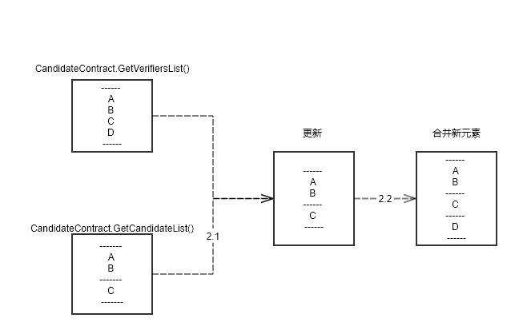

## 1、数据获取
#### 1.1、调用CandidateContract.GetVerifiersList()取得【验证节点快照数组】，结构如下：
```
[{验证节点对象}] // 【验证节点快照数组】
```
#### 1.2、调用CandidateContract.GetCandidateList()取得【提名和候选节点数组】，结构如下：
```
[
[{提名节点对象}], // 【提名节点数组】，里面可能有验证节点
[{候选节点对象}], // 【候选节点数组】
] // 【提名和候选节点数组】
```
## 2、排名处理规则
#### 2.1、对于在【提名和候选节点数组】存在，在【验证节点快照数组】也存在的节点，使用【验证节点快照数组】更新【提名和候选节点数组】中对应节点的信息
#### 2.2、对于在【验证节点快照数组】存在，在【提名和候选节点数组】中不存在的节点，直接添加到【提名和候选节点数组】里面，但依然是验证节点



