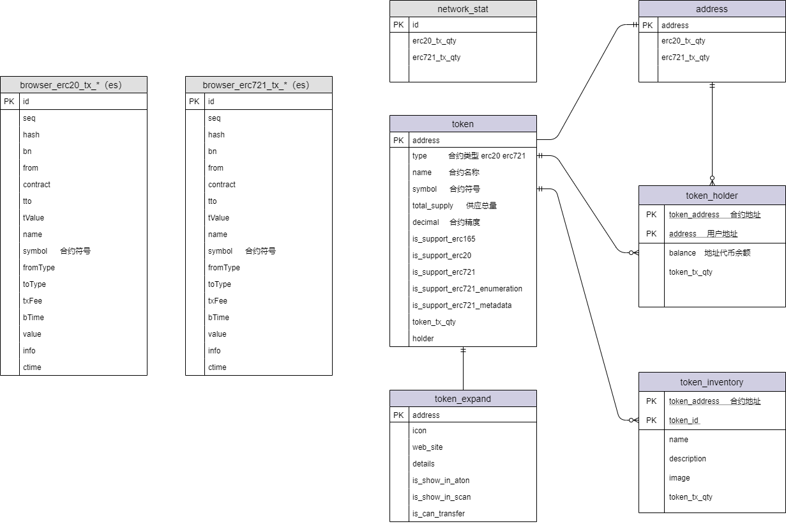

#### 1 协议设计

##### 1.1 ERC165（必须）

- function supportsInterface(bytes4 _interfaceID) external view returns (bool)

##### 1.2 ERC721（必须，并继承ERC165） 

- event Transfer(address indexed _from, address indexed _to, uint256 indexed _tokenId)  转账、 tokenId创建（0地址到owner地址）、tokenId销毁（owner地址到0地址）时需要触发事件
- event Approval(address indexed _owner, address indexed _approved, uint256 indexed _tokenId)
- event ApprovalForAll(address indexed _owner, address indexed _operator, bool _approved)
- function safeTransferFrom(address _from, address _to, uint256 _tokenId, bytes calldata _data) external
- function safeTransferFrom(address _from, address _to, uint256 _tokenId) external
- function transferFrom(address _from, address _to, uint256 _tokenId) external;
- function approve(address _approved, uint256 _tokenId) external
- function setApprovalForAll(address _operator, bool _approved) external
- function balanceOf(address _owner) external view returns (uint256)
- function ownerOf(uint256 _tokenId) external view returns (address)
- function getApproved(uint256 _tokenId) external view returns (address)
- function isApprovedForAll(address _owner, address _operator)  external view returns (bool)


##### 1.3 ERC721 metadata (可选，需继承ERC721)

- function name() external view returns (string memory _name)
- function symbol() external view returns (string memory _symbol)
- function tokenURI(uint256 _tokenId) external view returns (string memory)

```
ERC721 Metadata JSON Schema

{
    "title": "Asset Metadata",
    "type": "object",
    "properties": {
        "name": {
            "type": "string",
            "description": "Identifies the asset to which this NFT represents"
        },
        "description": {
            "type": "string",
            "description": "Describes the asset to which this NFT represents"
        },
        "image": {
            "type": "string",
            "description": "A URI pointing to a resource with mime type image/* representing the asset to which this NFT represents. Consider making any images at a width between 320 and 1080 pixels and aspect ratio between 1.91:1 and 4:5 inclusive."
        }
    }
}

```

##### 1.4 ERC721 enumeration (可选，需继承ERC721)

- function totalSupply() external view returns (uint256)
- function tokenByIndex(uint256 _index) external view returns (uint256)
- function tokenOfOwnerByIndex(address _owner, uint256 _index) external view returns (uint256)

##### 1.5 ERC721 tokenreceiver (可选，需继承ERC721) 

- function onERC721Received(address _operator, address _from, uint256 _tokenId, bytes calldata _data) external returns(bytes4)

##### 1.6 ERC20

- event Transfer(address indexed _from, address indexed _to, uint256 _value)
- event Approval(address indexed _owner, address indexed _spender, uint256 _value)
- function totalSupply() external view returns (uint256)
- function balanceOf(address _owner) external view returns (uint256 balance)
- function transfer(address _to, uint256 _value) external returns (bool success)
- function transferFrom(address _from, address _to, uint256 _value) external returns (bool success)
- function approve(address _spender, uint256 _value) external returns (bool success)
- function allowance(address _owner, address _spender) external view returns (uint256 remaining)
- function name() public view returns (string)
- function symbol() public view returns (string)
- function decimals() public view returns (uint8)
- function totalSupply() public view returns (uint256)

#### 2 合约识别

##### 2.1 ERC-165 识别

1. The source contract makes a STATICCALL to the destination address with input data: 0x01ffc9a701ffc9a700000000000000000000000000000000000000000000000000000000 and gas 30,000. This corresponds to contract.supportsInterface(0x01ffc9a7).
2. If the call fails or return false, the destination contract does not implement ERC-165.
3. If the call returns true, a second call is made with input data 0x01ffc9a7ffffffff00000000000000000000000000000000000000000000000000000000.
4. If the second call fails or returns true, the destination contract does not implement ERC-165.
5. Otherwise it implements ERC-165.

```
public boolean isSupportErc165(String contractAddress) throws Exception {
	Transaction transaction = Transaction.createEthCallTransaction(Credentials.create(Keys.createEcKeyPair()).getAddress(), contractAddress,"0x01ffc9a701ffc9a700000000000000000000000000000000000000000000000000000000");
	PlatonCall platonCall = web3j.platonCall(transaction, DefaultBlockParameterName.LATEST).send();
	if(!"0x0000000000000000000000000000000000000000000000000000000000000001".equals(platonCall.getResult())){
		return false;
	}

	transaction = Transaction.createEthCallTransaction(Credentials.create(Keys.createEcKeyPair()).getAddress(), contractAddress,"0x01ffc9a7ffffffff00000000000000000000000000000000000000000000000000000000");
	platonCall = web3j.platonCall(transaction, DefaultBlockParameterName.LATEST).send();
	if("0x0000000000000000000000000000000000000000000000000000000000000000".equals(platonCall.getResult())){
		return true;
	}
	return false;
}
```

##### 2.2 ERC-721 识别

1. check support ERC-165.
2. The source contract makes a STATICCALL to the destination address with input data: 0x01ffc9a780ac58cd00000000000000000000000000000000000000000000000000000000 . This corresponds to contract.supportsInterface(0x80ac58cd).

```
public boolean isSupportErc721(String contractAddress) throws Exception {
	Transaction transaction = Transaction.createEthCallTransaction(Credentials.create(Keys.createEcKeyPair()).getAddress(), contractAddress,"0x01ffc9a780ac58cd00000000000000000000000000000000000000000000000000000000");
	PlatonCall platonCall = web3j.platonCall(transaction, DefaultBlockParameterName.LATEST).send();
	if("0x0000000000000000000000000000000000000000000000000000000000000001".equals(platonCall.getResult())){
		return true;
	}
	return false;
}
```

##### 2.3 ERC-721 metadata 识别

1. check support ERC-165.
2. The source contract makes a STATICCALL to the destination address with input data: 0x01ffc9a75b5e139f00000000000000000000000000000000000000000000000000000000 . This corresponds to contract.supportsInterface(0x5b5e139f).


##### 2.4 ERC-721 enumerable 识别

1. check support ERC-165.
2. The source contract makes a STATICCALL to the destination address with input data: 0x01ffc9a7780e9d6300000000000000000000000000000000000000000000000000000000 . This corresponds to contract.supportsInterface(0x780e9d63).

##### 2.5 ERC-20 识别
1. 如果非erc721
2. check function name()
3. check function symbol()
4. check function decimals()
5. check function totalSupply()

#### 3 架构设计

##### 3.1 数据库设计



###### 3.1.1 新增token表

```
DROP TABLE IF EXISTS `token`;
CREATE TABLE `token` (
  `address` VARCHAR(64) NOT NULL COMMENT '合约地址',
  `type` VARCHAR(64) NOT NULL COMMENT '合约类型 erc20 erc721',
  `name` VARCHAR(64) COMMENT '合约名称',
  `symbol` VARCHAR(64) COMMENT '合约符号',
  `total_supply` bigint(80) COMMENT '供应总量',
  `decimal` bigint(80) COMMENT '合约精度',
  `is_support_erc165` tinyint(1) NOT NULL DEFAULT 0 COMMENT '是否支持erc165接口： 0-不支持 1-支持',
  `is_support_erc20` tinyint(1) NOT NULL DEFAULT 0 COMMENT '是否支持erc20接口： 0-不支持 1-支持',
  `is_support_erc721` tinyint(1) NOT NULL DEFAULT 0 COMMENT '是否支持erc721接口： 0-不支持 1-支持',
  `is_support_erc721_enumeration` tinyint(1) NOT NULL DEFAULT 0 COMMENT '是否支持erc721 enumeration接口： 0-不支持 1-支持',
  `is_support_erc721_metadata` tinyint(1) NOT NULL COMMENT '是否支持metadata接口： 0-不支持 1-支持',
  `create_time` timestamp NOT NULL DEFAULT CURRENT_TIMESTAMP COMMENT '创建时间',
  `update_time` timestamp NOT NULL DEFAULT CURRENT_TIMESTAMP ON UPDATE CURRENT_TIMESTAMP COMMENT '更新时间',
  PRIMARY KEY (`address`),
  UNIQUE KEY `token_address` (`address`)
)
```

###### 3.1.2 新增token_expand表

```
DROP TABLE IF EXISTS `token_expand`;
CREATE TABLE `token_expand` (
  `address` varchar(64) NOT NULL COMMENT '合约地址',
  `icon` text COMMENT '合约图标',
  `web_site` varchar(256) COMMENT '合约官网',
  `details` varchar(256) COMMENT '合约详情',
  `is_show_in_aton` tinyint(1) DEFAULT '0' COMMENT 'aton中是否显示，0-隐藏 1-展示',
  `is_show_in_scan` tinyint(1) DEFAULT '0' COMMENT 'scan中是否显示，0-隐藏 1-展示',
  `is_can_transfer` tinyint(1) DEFAULT '0' COMMENT '是否可转账 0-不可转账 1-可转账',
  `create_id` bigint(20) NOT NULL COMMENT '创建者',
  `create_name` varchar(50) NOT NULL COMMENT '创建者名称',
  `create_time` timestamp NOT NULL DEFAULT CURRENT_TIMESTAMP COMMENT '创建时间',
  `update_id` bigint(20) NOT NULL COMMENT '更新者',
  `update_name` varchar(50) NOT NULL COMMENT '更新者名称',
  `update_time` timestamp NOT NULL DEFAULT CURRENT_TIMESTAMP ON UPDATE CURRENT_TIMESTAMP COMMENT '更新时间',
  PRIMARY KEY (`address`)
)
```

###### 3.1.3 新增token_holder表

```
DROP TABLE IF EXISTS `token_holder`;
CREATE TABLE `token_holder` (
  `token_address` varchar(64) NOT NULL COMMENT '合约地址',
  `address` varchar(64) NOT NULL COMMENT '用户地址',
  `balance` bigint(80) COMMENT '地址代币余额, ERC20为金额，ERC721为tokenId数',
  `create_time` timestamp NOT NULL DEFAULT CURRENT_TIMESTAMP COMMENT '创建时间',
  `update_time` timestamp NOT NULL DEFAULT CURRENT_TIMESTAMP ON UPDATE CURRENT_TIMESTAMP COMMENT '更新时间',
  PRIMARY KEY (`token_address`,`address`)
)
```

###### 3.1.4 新增token_inventory表

```
DROP TABLE IF EXISTS `token_inventory`;
CREATE TABLE `token_inventory` (
  `token_address` varchar(64) NOT NULL COMMENT '合约地址',
  `token_id` bigint(80) NOT NULL COMMENT 'token id',
  `owner` varchar(64) NOT NULL COMMENT 'token id 对应持有者地址',
  `name` varchar(256) COMMENT 'Identifies the asset to which this NFT represents',
  `description` varchar(256) COMMENT 'Describes the asset to which this NFT represents',
  `image` varchar(256) COMMENT 'A URI pointing to a resource with mime type image/* representing the asset to which this NFT represents. Consider making any images at a width between 320 and 1080 pixels and aspect ratio between 1.91:1 and 4:5 inclusive.',
  `create_time` timestamp NOT NULL DEFAULT CURRENT_TIMESTAMP COMMENT '创建时间',
  `update_time` timestamp NOT NULL DEFAULT CURRENT_TIMESTAMP ON UPDATE CURRENT_TIMESTAMP COMMENT '更新时间',
  PRIMARY KEY (`token_address`,`token_id`)
)
```

###### 3.1.5 网络维度统计

```
-- 整个网络下erc721交易数
ALTER TABLE `network_stat` ADD COLUMN `erc721_tx_qty` INT(11) DEFAULT 0  NOT NULL COMMENT 'erc721 token对应的交易数';

-- 整个网络下erc20交易数
ALTER TABLE `network_stat` ADD COLUMN `erc20_tx_qty` INT(11) DEFAULT 0  NOT NULL COMMENT 'erc20 token对应的交易数';

```

###### 3.1.6 token维度统计

```
-- 该token合约产生的erc20或erc721交易数
ALTER TABLE `token` ADD COLUMN `token_tx_qty` INT(11) DEFAULT 0  NOT NULL COMMENT 'token对应的交易数';

-- 该token合约holder统计
ALTER TABLE `token` ADD COLUMN `holder` INT(11) DEFAULT 0  NOT NULL COMMENT 'token对应的持有人';

```

###### 3.1.7 token下inventory维度统计

```
-- 该token合约tokenId关联的erc721交易数
ALTER TABLE `token_inventory` ADD COLUMN `token_tx_qty` INT(11) DEFAULT 0  NOT NULL COMMENT 'token对应的交易数';

```

###### 3.1.8 token下holder维度统计

```
-- token下address关联的erc20或erc721交易数
ALTER TABLE `token_holder` ADD COLUMN `token_tx_qty` INT(11) DEFAULT 0  NOT NULL COMMENT 'erc721 token对应的交易数'; 

```

###### 3.1.9 address维度统计

```
-- 该地址关联的erc721交易数
ALTER TABLE `address` ADD COLUMN `erc721_tx_qty` INT(11) DEFAULT 0  NOT NULL COMMENT 'erc721 token对应的交易数';

-- 该地址关联的erc20交易数
ALTER TABLE `address` ADD COLUMN `erc20_tx_qty` INT(11) DEFAULT 0  NOT NULL COMMENT 'erc20 token对应的交易数';

```

##### 3.2 Elasticsearch设计

##### 3.2.1 *_erc721_tx 模板

```
{
  "index_patterns": [
    "*_erc721_tx"
  ],
  "settings": {
    "index": {
      "max_result_window": "2000000000",
      "number_of_shards": "5",
      "number_of_replicas": "1"
    }
  },
  "mappings": {
    "properties": {
      "seq": {                          //顺序号  交易所在块号*100000+本区块内部交易索引号
        "type": "long"
      },
      "name": {                         //名称
        "type": "text"
      },
      "symbol": {                       //币种符号
        "type": "keyword"
      },
      "decimal": {                      //币种精度
        "type": "integer"
      },
      "contract": {                     //合约地址
        "type": "keyword"
      },
      "hash": {                         //交易hash
        "type": "keyword"
      },
      "from": {                         //代币扣除方
        "type": "keyword"
      }, 
      "to": {                          //代币接收方
        "type": "keyword"
      },
      "value": {                       //代币数量或tokenId
        "type": "keyword"
      },
      "bn": {                           //交易所在块高
        "type": "long"
      },
      "bTime": {                        //交易时间
        "format": "yyyy-MM-dd HH:mm:ss||yyyy-MM-dd||epoch_millis",
        "type": "date"
      },
      "toType": {                      //地址类型 1：账号 2：内置合约 3：EVM合约 4:WASM合约 5:EVM-Token 6:WASM-Token
        "type": "integer"
      },
      "fromType": {                    //地址类型 1：账号 2：内置合约 3：EVM合约 4:WASM合约 5:EVM-Token 6:WASM-Token
        "type": "integer"
      },
      "remark": {                      //交易备注信息， aton使用
        "norms": false,
        "index": false,
        "type": "text",
        "doc_values": false
      },
      "txFee": {                       //交易手续费    
        "type": "keyword"
      }
    }
  }
}
```

##### 3.2.2 *_erc20_tx 模板(同 *_erc721_tx)

##### 3.2.3 *_transfer_tx 模板
> 合约内部转账交易

```
{
  "index_patterns": [
    "*_transfer_tx"
  ],
  "settings": {
    "index": {
      "max_result_window": "2000000000",
      "number_of_shards": "5",
      "number_of_replicas": "1"
    }
  },
  "mappings": {
    "properties": {
      "seq": {                          //顺序号  交易所在块号*100000+本区块内部交易索引号
        "type": "long"
      },
      "contract": {                     //合约地址
        "type": "keyword"
      },
      "hash": {                         //交易hash
        "type": "keyword"
      },
      "from": {                         //主币扣除方
        "type": "keyword"
      }, 
      "to": {                          //主币接收方
        "type": "keyword"
      },
      "value": {                       //主币数量
        "type": "keyword"
      },
      "bn": {                           //交易所在块高
        "type": "long"
      },
      "bTime": {                        //交易时间
        "format": "yyyy-MM-dd HH:mm:ss||yyyy-MM-dd||epoch_millis",
        "type": "date"
      },
      "toType": {                      //地址类型 1：账号 2：内置合约 3：EVM合约 4:WASM合约 5:EVM-Token 6:WASM-Token
        "type": "integer"
      },
      "fromType": {                    //地址类型 1：账号 2：内置合约 3：EVM合约 4:WASM合约 5:EVM-Token 6:WASM-Token
        "type": "integer"
      },
      "txFee": {                       //交易手续费    
        "type": "keyword"
      }
    }
  }
}
```

##### 3.2.4 *_transaction 模板

```
{
  "index_patterns": [
    "*_transaction"
  ],
  "settings": {
    "index": {
      "max_result_window": "2000000000",
      "number_of_shards": "5",
      "number_of_replicas": "1"
    }
  },
  "mappings": {
    "properties": {
      "type": {                   //交易类型 (定义见下文)
        "type": "short"
      },  
      "seq": {                     //顺序号  交易所在块号*100000+本区块内部交易索引号
        "type": "long"
      },
      "bHash": {                   //区块hash
        "type": "keyword"
      },
      "num": {                     //区块高度
        "type": "long"
      },
      "index": {                   //交易所在区块index
        "type": "short"
      },  
      "hash": {                    //交易hash
        "type": "keyword"
      },
      "from": {                    //交易发送地址
        "type": "keyword"
      },
      "to": {                      //交易接收地址
        "type": "keyword"
      },
      "fromType": {                //地址类型 1：账号 2：内置合约 3：EVM合约 4:WASM合约 5:EVM-Token 6:WASM-Token
        "type": "integer"
      },
      "toType": {                 //地址类型 1：账号 2：内置合约 3：EVM合约 4:WASM合约 5:EVM-Token 6:WASM-Token
        "type": "integer"
      },
      "nonce": {                   //交易nonce
        "type": "long"
      },  
      "gasLimit": {               //gasLimit
        "norms": false,
        "index": false,
        "type": "text",
        "doc_values": false
      },      
      "gasPrice": {               //gasPrice
        "norms": false,
        "index": false,
        "type": "text",
        "doc_values": false
      },
      "gasUsed": {               //gasUsed
        "norms": false,
        "index": false,
        "type": "text",
        "doc_values": false
      },
      "cost": {                   //手续费 gasPrice * gasUsed
        "norms": false,
        "index": false,
        "type": "text",
        "doc_values": false
      },
      "value": {                  //金额
        "type": "text"
      },
      "status": {                 //交易状态 1-成功  2-失败
        "type": "integer"
      }
      "time": {                   //链上交易时间
        "format": "yyyy-MM-dd HH:mm:ss||yyyy-MM-dd||epoch_millis",
        "type": "date"
      },
      "input": {                  //交易input
        "norms": false,
        "index": false,
        "type": "text",
        "doc_values": false
      },
      "info": {                   //ppos相关交易解析后json字符串定义(定义见下文)
        "norms": false,
        "index": false,
        "type": "text",
        "doc_values": false
      },
      "erc721TxInfo": {             //合约中erc721内部交易定义，json数组。（对象定义参考  *_erc721_tx 模板）
        "norms": false,
        "index": false,
        "type": "text",
        "doc_values": false
      },      
      "erc20TxInfo": {             //合约中erc721内部交易定义，json数组。（对象定义参考  *_erc20_tx 模板）
        "norms": false,
        "index": false,
        "type": "text",
        "doc_values": false
      },   
      "transferTxInfo": {          //合约中内部交易定义，json数组。（对象定义参考 *_transfer_tx 模板）
        "norms": false,
        "index": false,
        "type": "text",
        "doc_values": false
      },  
      "pposTxInfo": {             //合约中erc721内部交易定义，json数组。（对象定义参考 type及info定义）
        "norms": false,
        "index": false,
        "type": "text",
        "doc_values": false
      },   
      "failReason": {            //交易失败原因
        "norms": false,
        "index": false,
        "type": "text",
        "doc_values": false
      },      
      "creTime": {               //本地创建时间
        "format": "yyyy-MM-dd HH:mm:ss||yyyy-MM-dd||epoch_millis",
        "type": "date"
      },
      "updTime": {               //本地更新时间
        "format": "yyyy-MM-dd HH:mm:ss||yyyy-MM-dd||epoch_millis",
        "type": "date"
      },
      "remark": {                //交易备注信息， aton使用
        "norms": false,
        "index": false,
        "type": "text",
        "doc_values": false
      }
    }
  }
}

```

##### type及info定义

###### type=0:转账
###### type=1:EVM合约发布(合约创建)
###### type=2:合约调用(合约执行)
###### type=3:WASM合约发布(合约创建)
###### type=4:其他
###### type=5:MPC交易
###### type=6:ERC20合约发布(合约创建)
###### type=7:ERC20合约调用(合约执行)
###### type=8:ERC721合约发布(合约创建)
###### type=9:ERC721合约调用(合约执行)
###### type=1000:发起质押(创建验证人)

```
{
    "type":0,                   //表示使用账户自由金额还是账户的锁仓金额做质押，0: 自由金额； 1: 锁仓金额，2: 混合模式
    "benefitAddress":"",        //用于接受出块奖励和质押奖励的收益账户
    "nodeId":"",                //被质押的节点Id(也叫候选人的节点Id)
    "externalId":"",            //外部Id(有长度限制，给第三方拉取节点描述的Id)
    "nodeName":"",              //被质押节点的名称(有长度限制，表示该节点的名称)
    "website":"",               //节点的第三方主页(有长度限制，表示该节点的主页)
    "details":"",               //节点的描述(有长度限制，表示该节点的描述)
    "amount":"",                //质押的von
    "programVersion":"",        //程序的真实版本，治理rpc获取
    "rewardPer":""              //委托所得到的奖励分成比例
}

```

###### type=1001: 修改质押信息(编辑验证人)

```
{
    "benefitAddress":"",    //用于接受出块奖励和质押奖励的收益账户
    "nodeId":"",            //被质押的节点Id(也叫候选人的节点Id)
    "externalId":"",        //外部Id(有长度限制，给第三方拉取节点描述的Id)
    "nodeName":"",          //被质押节点的名称(有长度限制，表示该节点的名称)
    "website":"",           //节点的第三方主页(有长度限制，表示该节点的主页)
    "details":"",           //节点的描述(有长度限制，表示该节点的描述)
    "rewardPer":""          //委托所得到的奖励分成比例
}

```

###### type=1002: 增持质押(增加自有质押)

```
{
    "type":0,               //表示使用账户自由金额还是账户的锁仓金额做质押，0: 自由金额； 1: 锁仓金额，2: 混合模式
    "nodeId":"",            //被质押的节点Id(也叫候选人的节点Id)
    "amount":"",            //质押的von
    "nodeName":"",          //<需要冗余>被质押节点的名称(有长度限制，表示该节点的名称)
    “stakingBlockNum”:""    //<需要冗余> 质押交易快高
}

```

###### type=1003: 撤销质押(退出验证人)

```
{
    "nodeId":"",              //被质押的节点Id(也叫候选人的节点Id)
    "nodeName":"",            //<需要冗余>被质押节点的名称(有长度限制，表示该节点的名称)
    "stakingBlockNum":"",     //<需要冗余> 质押交易快高
    "amount":""               //<需要冗余> 质押的von
}

```

###### type=1004: 发起委托(委托)

```
{
    "type":0,                //表示使用账户自由金额还是账户的锁仓金额做质押，0: 自由金额； 1: 锁仓金额
    "nodeId":"",             //被质押的节点Id(也叫候选人的节点Id)
    "amount":"",             //委托的金额(按照最小单位算，1LAT = 10**18 von)
    "nodeName":"",           //<需要冗余>被质押节点的名称(有长度限制，表示该节点的名称)
    “stakingBlockNum”:""     //<需要冗余> 质押交易快高
}

```

###### type=1005: 减持/撤销委托(赎回委托)

```
{
    "stakingBlockNum":111,      //代表着某个node的某次质押的唯一标示
    "nodeId":"",                //被质押的节点Id(也叫候选人的节点Id)
    "amount":"",                //减持委托的金额(按照最小单位算，1LAT = 10**18 von)
    "nodeName":"",              //<需要冗余>被质押节点的名称(有长度限制，表示该节点的名称)
    "realAmount":"",            //<需要冗余>真正减持的金额
    "delegateIncome":""         //委托的收益
}

```

###### type=2000: 提交文本提案(创建提案)

```
{
    "verifier":111,             //提交提案的验证人
    "pIDID":"",                 //PIPID
    "nodeName":""               //<需要冗余>提交提案的验证人名称(有长度限制，表示该节点的名称)
}

```

###### type=2001: 提交升级提案(创建提案)

```
{
    "verifier":111,          //提交提案的验证人
    "pIDID":"",              //pIDID
    "newVersion":111,        //升级版本
    "endVotingRounds":11,    //投票共识轮数量
    "nodeName":""            //<需要冗余>提交提案的验证人名称(有长度限制，表示该节点的名称)
}

```

###### type=2002: 提交参数提案(创建提案)
```
{
    "verifier":111,          //提交提案的验证人
    "pIDID":"",              //pIDID
    "nodeName":""            //<需要冗余>提交提案的验证人名称(有长度限制，表示该节点的名称)
    "module":"",             //参数模块
    "name":"",               //参数名称
    "newValue":""            //参数新值
}

```

###### type=2003: 给提案投票(提案投票)
```
{
    "verifier":111,          //投票的验证人
    "nodeName":""            //<需要冗余>投票的验证人的名称(有长度限制，表示该节点的名称)
    "proposalID":"",         //提案ID
    "option":"",             //投票选项 0x01：支持  0x02：反对 0x03：弃权 
    "programVersion":"",     //节点代码版本，
    "versionSign":"",        //代码版本签名
    "pIDID":"",              //<需要冗余>提案的pIDID
    "proposalType":""        //<需要冗余>提案类型 1:文本提案 2:升级提案 4:取消提案
}

```

###### type=2004: 版本声明

```
{
    "activeNode":111,        //声明的节点，只能是验证人/候选人
    "nodeName":"",           //<需要冗余>被质押节点的名称(有长度限制，表示该节点的名称)
    "version":111,           //声明的版本
    "versionSign":''         //声明的版本签名
}

```

###### type=2005: 提交取消提案

```
{
    "verifier":111,                 //提交提案的验证人
    "pIDID":"",                     //pIDID
    "endVotingRounds":111,          //投票共识轮数量
    "tobeCanceledProposalID":"",    //待取消的升级提案ID
    "nodeName":""                   //<需要冗余>提交提案的验证人名称(有长度限制，表示该节点的名称)
}

```

###### type=3000: 举报多签(举报验证人)

```
{
    "data":"{jsonObj}",              //证据的json值，格式为RPC接口Evidences的返回值
    "type":"",                       //双签类型:1: prepareBlock 2: prepareVote 3: viewChange
    "verify":"",                     //举报的节点id
    "nodeName":"",                   //<需要冗余>被质押节点的名称(有长度限制，表示该节点的名称)
    "stakingBlockNum":""             //<需要冗余> 质押交易快高
    "reward":""                      //惩罚奖励 
}

```

###### type=4000: 创建锁仓计划(创建锁仓)

```
{
    "account":""            //锁仓释放到账账户
    "plan":[
        {
         "epoch":11,        //表示结算周期的倍数。与每个结算周期出块数的乘积表示在目标区块高度上释放锁定的资金。Epoch * 每周期的区块数至少要大于最高不可逆区块高度
         "amount":111       //表示目标区块上待释放的金额
        }
    ]
}

```

###### type=5000: 领取奖励
```
{
    "rewardItem":[
        {
            "nodeId":"",             //节点ID
            "stakingBlockNum":"",    //节点的质押块高
            "reward":"",             //领取到的收益
            "nodeName":""            //<需要冗余>投票的验证人的名称(有长度限制，表示该节点的名称)
        }
    ]
}

```


##### 3.3 特殊节点设计
1. 批量交易回执接口 交易hash -> 合约地址列表