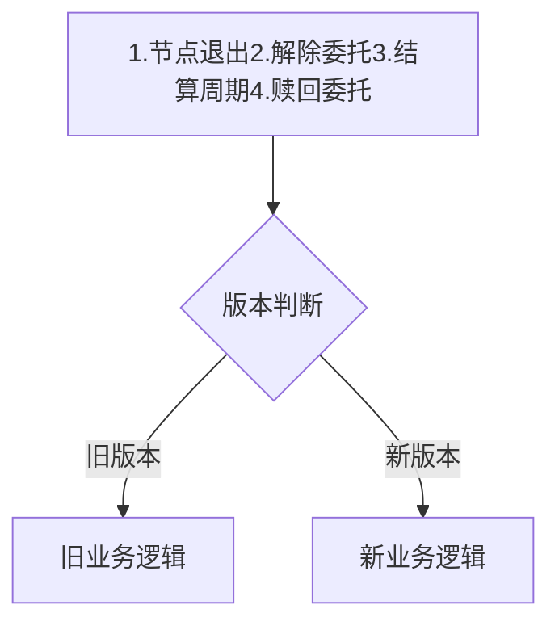
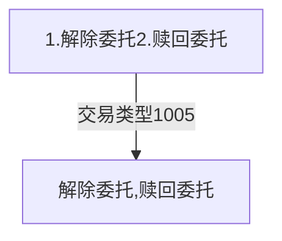
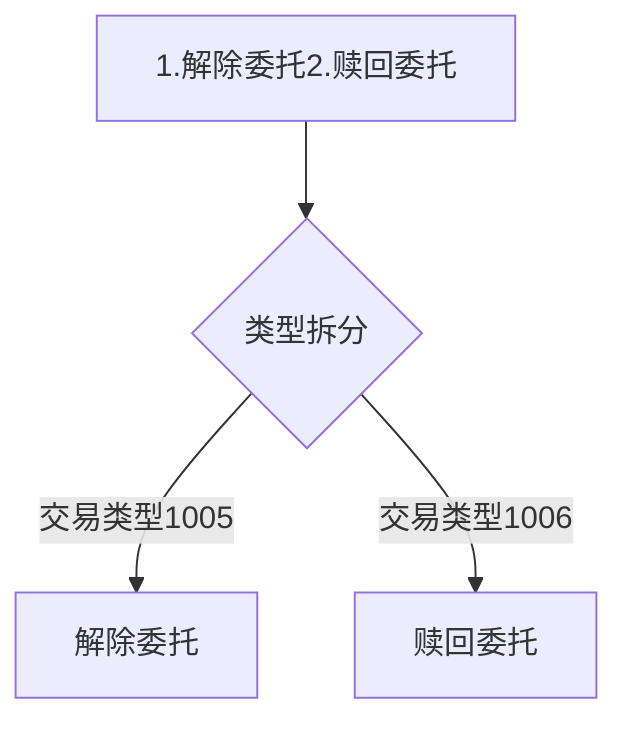

## 一、流程影响

### 1.network表新增 active_version字段

    1)active_version字段存放当前生效版本,配置文件新增链初始版本。
    
    2)程序在初始化时加载 active_version 配置信息到内存(先查找数据库，如果查询为null，则加载配置文件中的初始版本)。 当有升级提案通过时，更新 active_version版本号。
    
    3)在委托锁定流程当中，为了兼容旧版本逻辑，在业务逻辑【节点退出】、【解除委托】、【结算周期】、【赎回委托】需要做版本判断，流程如下：



伪代码实现(委托解除)：

```java
    /**
     * 委托解除
     *
     * @param event Collection事件
     * @param tx    交易
     * @return com.platon.browser.bean.DelegateExitResult
     * @date 2021/2/3
     */
    @Override
    public DelegateExitResult analyze(CollectionEvent event, Transaction tx) {
        DelegateExitResult res = null;
        try {
            if (VersionEnum.compareVersion(VersionEnum.V01600.getVersion(), "0.15.2.0") < 0) {
                res = v01520DelegateExitAnalyzer.analyze(event, tx);
            } else {
                res = v01600DelegateExitAnalyzer.analyze(event, tx);
            }
        } catch (Exception e) {
            log.error("撤销委托业务参数转换器分析异常", e);
        }
        return res;
    }
```
### 2.交易类型拆分
(解除委托)原实现逻辑：

现版本实现逻辑：

把逻辑方法按交易类型拆分，拆分为【1005-解除委托】、【1006-赎回委托】


## 二、字段修改

### 1.ES字段修改

| ES \*_transaction设计                                        |
| ------------------------------------------------------------ |
| 1.type=1005，字段添加unFrozenNum                             |
| ###### type=1005: 减持/撤销委托<br/>{<br/>    "stakingBlockNum":111,      //代表着某个node的某次质押的唯一标示<br/>    "nodeId":"",                          //被质押的节点Id(也叫候选人的节点Id)<br/>    "amount":"",                         //减持委托的金额(按照最小单位算，1LAT = 10**18 von)<br/>    "nodeName":"",                   //<需要冗余>被质押节点的名称(有长度限制，表示该节点的名称)<br/>    "realAmount":"",                  //<需要冗余>真正减持的金额<br/>    "delegateIncome":""            //委托的收益<br/>    "unFrozenNum":1                //冻结解锁块高<br/>} |
| 2.新增type类型，type=1006                                    |
| ###### type=1006: 赎回委托<br/>{<br/>    "stakingBlockNum":111,      //代表着某个node的某次质押的唯一标示<br/>    "nodeId":"",                          //被质押的节点Id(也叫候选人的节点Id)<br/>    "nodeName":"",                   //<需要冗余>被质押节点的名称(有长度限制，表示该节点的名称)<br/>    "delegateIncome":""            //委托的收益<br/>} |

### 2.MySQL字段修改

| MySQL字段修改                                                |
| ------------------------------------------------------------ |
| a、治理参数入库服务新增【解委托冻结周期数】：un_delegate_freeze_duration<br/>b、委托表新增【解委托生效块号】字段 frozen_end_block<br/>c、委托表新增【冻结中】字段 delegate_frozen<br/>d、委托表新增【待赎回】字段 delegate_redeem<br/>e、委托表新增【失效犹豫】字段 delegate_hes_invalid<br/>f、 地址表新增【冻结中委托】字段 delegate_frozen<br/>g、地址表新增【待赎回】字段 delegate_redeem<br/>h、地址表delegate_released 改成  delegate_invalid<br/>i、 质押表、质押历史字段修改。 stat_delegate_released 改成 stat_delegate_invalid（失效的委托）<br/>j、 节点表字段修改。 stat_delegate_released 改成 stat_delegate_invalid（失效的委托）<br/>k、network表新增 active_version字段 |

对应sql

```sql
ALTER TABLE `delegation` ADD COLUMN `delegate_hes_invalid` DECIMAL ( 65, 0 ) DEFAULT 0 NOT NULL COMMENT '失效未锁定委托金额(von)' AFTER `delegate_locked`,
CHANGE `delegate_released` `delegate_locked_invalid` DECIMAL ( 65, 0 ) DEFAULT 0 NOT NULL COMMENT '失效已锁定委托金额(von)' AFTER `delegate_hes_invalid`,
ADD COLUMN `delegate_frozen` DECIMAL ( 65, 0 ) DEFAULT 0 NOT NULL COMMENT '冻结中' AFTER `delegate_locked_invalid`,
ADD COLUMN `delegate_redeem` DECIMAL ( 65, 0 ) DEFAULT 0 NOT NULL COMMENT '待赎回' AFTER `delegate_frozen`,
ADD COLUMN `frozen_end_block` BIGINT ( 20 ) NULL COMMENT '解委托生效块号' AFTER `cur_delegation_block_num`;

ALTER TABLE `address` ADD COLUMN `delegate_frozen` DECIMAL ( 65, 0 ) DEFAULT 0 NOT NULL COMMENT '冻结中委托' AFTER `delegate_released`,
ADD COLUMN `delegate_redeem` DECIMAL ( 65, 0 ) DEFAULT 0 NOT NULL COMMENT '待赎回委托' AFTER `delegate_frozen`;

ALTER TABLE `staking` CHANGE `stat_delegate_released` `stat_delegate_invalid` DECIMAL ( 65, 0 ) DEFAULT 0 NOT NULL COMMENT '失效的委托(von)';

ALTER TABLE `node` CHANGE `stat_delegate_released` `stat_delegate_invalid` DECIMAL ( 65, 0 ) DEFAULT 0 NOT NULL COMMENT '失效的委托(von)';

ALTER TABLE `staking_history` CHANGE `stat_delegate_released` `stat_delegate_invalid` DECIMAL ( 65, 0 ) DEFAULT 0 NOT NULL COMMENT '失效的委托(von)';

ALTER TABLE `network_stat` ADD COLUMN `active_version` int(11) DEFAULT '0' NOT NULL COMMENT '当前版本号' AFTER `erc20_tx_qty`;
```


### 3.修改后委托表金额相关字段

| 字段                    | 含义          | 解释                                                         |
| ----------------------- | ------------- | ------------------------------------------------------------ |
| delegate_hes            | 有效犹豫(von) | 委托交易成功后，新增的委托金额                               |
| delegate_hes_invalid    | 失效犹豫(von) | 由于节点退出导致【delegate_hes】的金额挪动到【delegate_hes_invalid】 |
| delegate_locked         | 有效锁定(von) | 犹豫期的金额经过指定结算周期后变为有效的锁定委托金额         |
| delegate_locked_invalid | 失效锁定(von) | 由于节点退出导致【delegate_locked】的金额挪动到【delegate_locked_invalid】 |
| delegate_frozen         | 冻结中(von)   | 由于用户申请解委托导致【delegate_locked】或【delegate_released】中的金额被挪动到【delegate_frozen】 |
| delegate_redeem         | 待赎回(von)   | 由于冻结结束导致【delegate_frozen】的金额被挪动到【delegate_redeem】 |

### 4.业务逻辑字段修改

#### 4.1节点退出

| 模块     | 字段逻辑                                                     |
| -------- | ------------------------------------------------------------ |
| 委托记录 | 【delegate_hes】挪到【delegate_hes_invalid】 -- 犹豫期委托变为失效犹豫委托 |
| 委托记录 | 【delegate_locked】挪到【delegate_locked_invalid】 -- 锁定期委托变为失效锁定委托 |
| 质押记录 | 【stat_delegate_released（重命名为 stat_delegate_invalid - 失效委托）】加上委托的(【delegate_hes】+【delegate_locked】) -- 保持前一版本逻辑 |
| 质押记录 | 【stat_delegate_hes】减去委托的【delegate_hes】 -- 保持前一版本逻辑 |
| 质押记录 | 【stat_delegate_locked】减去委托的【delegate_locked】 -- 保持前一版本逻辑 |
| 节点记录 | 【stat_delegate_released（重命名为 stat_delegate_invalid - 失效委托）】加上委托的(【delegate_hes】+【delegate_locked】) -- 保持前一版本逻辑 |
| 节点记录 | 【stat_delegate_value】 减去委托的(【delegate_hes】+【delegate_locked】) |
| 地址记录 | 【delegate_hes】 减去委托的【delegate_hes】 -- 保持前一版本逻辑 |
| 地址记录 | 【delegate_locked】  减去委托的【delegate_locked】 -- 保持前一版本逻辑 |
| 地址记录 | 【delegate_released（重命名为 stat_delegate_invalid - 失效委托）】 加上委托的【delegate_locked】 -- 保持前一版本逻辑 |


#### 4.2解除委托

| 模块     | 字段逻辑                                                     |
| -------- | ------------------------------------------------------------ |
| 委托记录 | 计算&记录【解冻结生效块号：frozen_end_block】=(【解委托所在结算周期数】+【解委托冻结算周期数】)*【每个结算周期的区块数量】） |
| 委托记录 | 委托记录真实解除金额【realRefundAmount】： 先扣犹豫期，犹豫期不够再扣锁定<br/>1.扣除【delegate_hes】或【delegate_hes_invalid】的金额直接到账<br/>2.犹豫不够扣，再扣除【delegate_locked】或【delegate_locked_invalid】的金额到【delegate_frozen】 |
| 质押记录 | 如果节点未退出：`stat_delegate_hes` = `stat_delegate_hes` - realRefundAmount犹豫期部分 |
| 质押记录 | 如果节点未退出：`stat_delegate_locked` = `stat_delegate_locked` - realRefundAmount锁定部分 |
| 质押记录 | 如果节点已退出：`stat_delegate_released`（重命名为 stat_delegate_invalid - 失效委托） = `stat_delegate_released` - realRefundAmount |
| 质押记录 | 新增字段 stat_delegate_frozen = stat_delegate_frozen + realRefundAmount真实冻结部分 |
| 节点记录 | `total_value` = `total_value` - realRefundAmount             |
| 节点记录 | 如果节点未退出：`stat_delegate_value` = `stat_delegate_value` -  realRefundAmount |
| 地址记录 | 【delegate_hes】 减去委托的【delegate_hes】 -- 保持前一版本逻辑 |
| 地址记录 | 如果节点未退出：【delegate_locked】 - realRefundAmount锁定部分 |
| 地址记录 | 如果节点已退出：【delegate_released（重命名为 stat_delegate_invalid - 失效委托）】 - realRefundAmount |
| 地址记录 | 新增字段：delegate_frozen = stat_delegate_frozen + realRefundAmount真实冻结部分 |

#### 4.3结算周期

| 字段逻辑                                                     |
| ------------------------------------------------------------ |
| 当前结算周期切换块号如果等于委托的【frozen_end_block】，即委托金额冻结结束，则执行后续步骤 |
| 委托记录解冻金额 unfrozenAmount：【delegate_frozen】挪到【delegate_redeem】，即【解冻金额】挪到待赎回 |
| 质押和节点记录<br/>1.stat_delegate_redeem（新增字段） = stat_delegate_redeem + unfrozenAmount<br/>2.stat_delegate_frozen = stat_delegate_frozen - unfrozenAmount |

#### 4.4赎回委托

| 模块           | 字段逻辑                                                     |
| -------------- | ------------------------------------------------------------ |
| 委托记录       | 【delegate_redeem】置零（因为底层赎回交易没有指定赎回金额）  |
| 委托记录       | 如果以下所有字段金额为0，则委托置为历史：<br/>delegate_hes                有效犹豫(von) <br/>delegate_hes_invalid    失效犹豫(von) <br/>delegate_locked            有效锁定(von) <br/>delegate_released         失效锁定(von) <br/>delegate_frozen             冻结中(von)  <br/>delegate_redeem           待赎回(von) |
| 质押和节点记录 | stat_delegate_redeem（新增字段） = stat_delegate_redeem - 委托的【delegate_redeem】 |
| 质押和节点记录 | 执行领取奖励部分逻辑: `have_dele_reward` = `have_dele_reward` + 奖励金额 |
| 质押和节点记录 | 地址表：StatisticsAddressConverter 里面更新委托奖励字段      |

#### 4.5任务

| 字段逻辑                                                     |
| ------------------------------------------------------------ |
| 地址记录：AddressUpdateTask中添加【delegate_redeem】和【delegate_frozen】字段的更新逻辑 |

### 5.前端接口修改

| 接口                                  | 返回参数                                                     |
| ------------------------------------- | ------------------------------------------------------------ |
| /staking/delegationListByStaking      | {<br/>  delegateAddr: 委托人地址 （delegation表）,<br/>  delegateValue: 委托金额 （delegation表  delegate_hes+delegate_locked）,<br/>  delegateTotalValue:验证人委托的总金额（staking表 delegate_hes+delegate_locked）,<br/>  delegateLocked:已锁定委托（LAT）如果关联的验证人状态正常则正常显示，如果其他情况则为零（delegation）,<br/>  delegateInvalid:当前验证人已失效的委托（字段重命名）,<br/>  delegateFrozen:冻结中（新增）,<br/>  delegateRedeem: 待赎回（新增）,<br/>} |
| /staking/delegationListByAddress      | {	<br/>  nodeId:节点id，<br/>  nodeName:节点名称，<br/>  delegateValue:委托数量（delegation表 delegateHes+delegateLocked），<br/>  delegateHas:未锁定委托（LAT） 如果关联的验证人状态正常则正常显示，如果其他情况则为零 （delegation），<br/>  delegateLocked:已锁定委托（LAT）如果关联的验证人状态正常则正常显示，如果其他情况则为零（delegation），<br/>  delegateUnlock:已解除委托（LAT） 如果关联的验证人状态退出中或已退出则为 delegateHas+delegateLocked，如果其他情况则为0（delegation），<br/>  delegateReleased:待赎回委托（LAT） （delegation表），<br/>  delegateClaim:待领取委托（LAT），<br/>  delegateFrozen:冻结中（新增）,<br/>  delegateRedeem: 待赎回（新增）<br/>} |
| /extra/queryConfig                    | 新增返回字段<br/>un_delegate_freeze_duration：解委托冻结周期数 |
| /transaction/transactionDetails       | 新增返回字段<br/>unDelegateFreezeNum:预计解冻块高            |
| /transaction/transactionList          | txType：<br/>交易类型,可用值:0-转账,<br/>1-合约发布(合约创建),<br/>2-合约调用(合约执行),<br/>4-其他,<br/>5-MPC交易,<br/>6-erc20合约创建,<br/>7-erc20合约执行,<br/>8-erc721合约创建,<br/>9-erc721合约执行,<br/>1000-发起质押 (创建验证人),<br/>1001-修改质押信息(修改验证人),<br/>1002-增持质押(增持自由质押),<br/>1003-撤销质押(退出验证人),<br/>1004-发起委托 (委托),<br/>1005-减持/撤销委托,<br/>1006-赎回委托,<br/>2000-提交文本提案 (创建提案),<br/>2001-提交升级提案(提交提案),<br/>2002-提交参数提案(提交提案-去除暂时不要),<br/>2003-给提案投票(提案投票),<br/>2004-版本声明,<br/>2005-取消提案,<br/>3000-举报多签(举报验证人),<br/>4000-创建锁仓计划(创建锁仓),<br/>5000-领取奖励 |
| /transaction/transactionListByBlock   | txType：<br/>交易类型,可用值:0-转账,<br/>1-合约发布(合约创建),<br/>2-合约调用(合约执行),<br/>4-其他,<br/>5-MPC交易,<br/>6-erc20合约创建,<br/>7-erc20合约执行,<br/>8-erc721合约创建,<br/>9-erc721合约执行,<br/>1000-发起质押 (创建验证人),<br/>1001-修改质押信息(修改验证人),<br/>1002-增持质押(增持自由质押),<br/>1003-撤销质押(退出验证人),<br/>1004-发起委托 (委托),<br/>1005-减持/撤销委托,<br/>1006-赎回委托,<br/>2000-提交文本提案 (创建提案),<br/>2001-提交升级提案(提交提案),<br/>2002-提交参数提案(提交提案-去除暂时不要),<br/>2003-给提案投票(提案投票),<br/>2004-版本声明,<br/>2005-取消提案,<br/>3000-举报多签(举报验证人),<br/>4000-创建锁仓计划(创建锁仓),<br/>5000-领取奖励 |
| /transaction/transactionListByAddress | txType：<br/>交易类型,可用值:0-转账,<br/>1-合约发布(合约创建),<br/>2-合约调用(合约执行),<br/>4-其他,<br/>5-MPC交易,<br/>6-erc20合约创建,<br/>7-erc20合约执行,<br/>8-erc721合约创建,<br/>9-erc721合约执行,<br/>1000-发起质押 (创建验证人),<br/>1001-修改质押信息(修改验证人),<br/>1002-增持质押(增持自由质押),<br/>1003-撤销质押(退出验证人),<br/>1004-发起委托 (委托),<br/>1005-减持/撤销委托,<br/>1006-赎回委托,<br/>2000-提交文本提案 (创建提案),<br/>2001-提交升级提案(提交提案),<br/>2002-提交参数提案(提交提案-去除暂时不要),<br/>2003-给提案投票(提案投票),<br/>2004-版本声明,<br/>2005-取消提案,<br/>3000-举报多签(举报验证人),<br/>4000-创建锁仓计划(创建锁仓),<br/>5000-领取奖励 |

## 三、工作分工

- 架构细化：                已完成
- 环境准备：                黄永鹏
- agent端修改：          
    1. 节点退出：         黄永鹏
    2. 解除委托：         黄永鹏
    3. 结算周期：         黄永鹏
    4. 赎回委托：         黄永鹏
    5. 任务：                张榕锦
    6. 版本兼容性：     刘树禹
- api端修改：              张榕锦
- web端修改：            陈智
- 系统联调：               陈智、黄永鹏、刘树禹、张榕锦

## 四、对用户影响

需要先清库再同步数据，不然会造成数据污染。