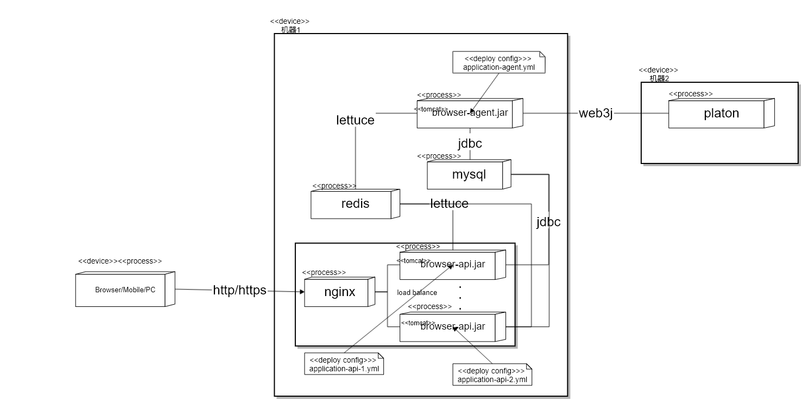
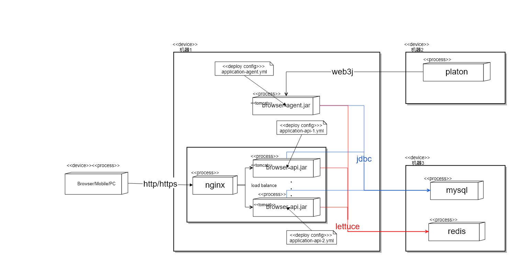
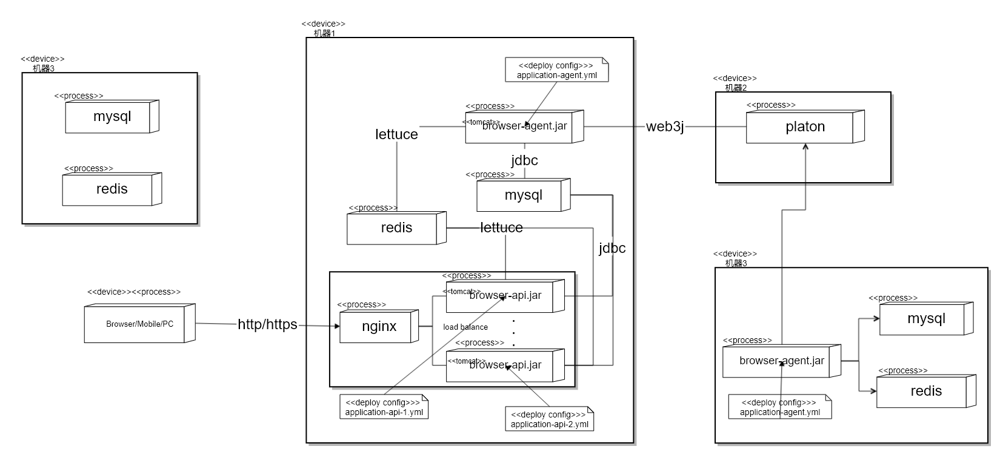

## 浏览器线上部署环境调整方案

### 1、当前状态说明
当前浏览器应用（数据采集进程browser-agent、对外接口服务进程browser-api）及其相关服务（Mysql、Redis集群）同处同一台机器，共用同一个磁盘，其部署图如下：

由于数据采集端会频繁访问Mysql和Redis集群进行数据的写入，导致它们之间对磁盘I/O资源的争夺，进而引起Redis集群和Mysql数据库访问超时问题。

### 2、优化方案说明
基于上述问题分析，现计划申请一台性能较好的机器（下图中【机器3】），把Mysql和Redis安装在这台机器上，最终的部署图如下：

### 3、环境平稳切换步骤说明
为保证旧环境服务可继续对外提供服务，以及新环境的数据完整性，【机器3】中Mysql和Redis的数据不从机器1中的Mysql和Redis迁移，而是重新从链上采集，待【机器3】上的数据与链上同步后，再在机器1上配置启动新的browser-agent和browser-api进程连接至机器3的Mysql和Redis，待新的进程启动完成并验证没有问题后，把nginx指向新的browser-api进程，并停止【机器1】上旧的browser-api进程和browser-agent进程。
因此，整个环境升级总结如下：
##### 3.1、保留机器1的当前状态不要动，在新机器（下图机器3）安装Mysql和Redis，并在上面启动browser-agent进程从机器2上采集数据入库到机器3上的Mysql和Redis，此时的部署结构如下：

##### 3.2、待机【器3上】的数据与链上同步后，再在【机器1】上配置启动新的browser-agent和browser-api进程连接至【机器3】的Mysql和Redis，待新的进程启动完成并验证没有问题后，把nginx指向新的browser-api进程，并停止机器1上旧的browser-api进程和browser-agent进程，最终的部署结构如下：

